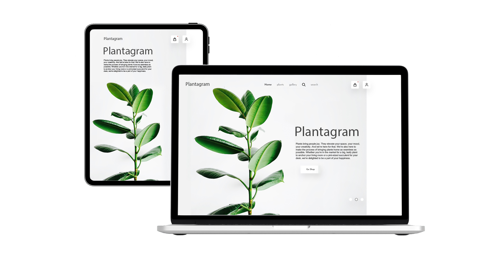

# Plantagram  
An e-commerce for selling plants. Plantagram utlizes the technologies listed below to allow registered users or guests to create and edit shopping carts, search for items using filters, and proceed to checkout. Plantagram also takes care of inventory management, ensuring that any price changes are represented in a users cart until the time of purchase, and that no out-of-stock products are listed as available.  
Tech Stack: Javascript, React, Redux, Node, Express, PostgreSQL, Sequelize ORM, Google OAuth, Material-UI.

  

## Setup
To run this project, navigate to the directory and run one of the following yarn commands.

- ```cd Finance_Manager```
- ```npm install``` or ```yarn install```
- ```yarn start #``` you can open iOS, Android, or web from here, or run them directly with the commands below.
- ```yarn android``` or ```yarn ios``` or ```yarn web```  

